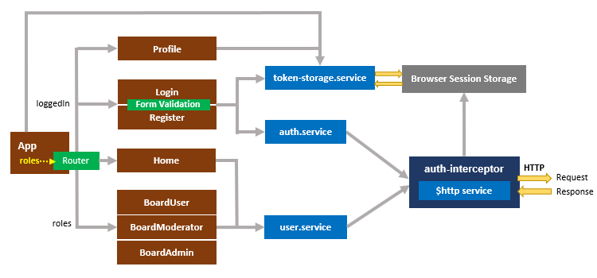

# Angular 8 JWT Authentication example

## Flow for User Registration and User Login
For JWT – Token based Authentication with Web API, we’re gonna call 2 endpoints:
- POST `api/auth/signup` for User Registration
- POST `api/auth/signin` for User Login

You can take a look at following flow to have an overview of Requests and Responses that Angular 10 Client will make or receive.

## Angular JWT App Diagram with Router and HttpInterceptor

Run `ng serve --port 8081` for a dev server. Navigate to `http://localhost:8081/`.
